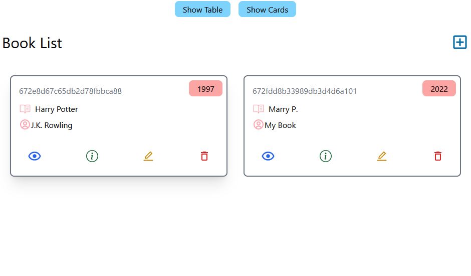

Book Store is a small MERN Application that helps us to store, read, edit, delete books.

<h1>Book Store App - Live Demo</h1>

Clone or download:

<h2>Usage</h2>
<h3>Prerequisites</h3>

<h3>MongoDB</h3>
<h4>Node ^20.0.0</h4>
<h4>npm</h4>

<ul>Server-side usage (PORT: 5555)</ul>
 <li>cd backend   // go to server folder</li>
 <li>npm install</li>
 <li>npm start </li>
 
<ul>Client-side usage:</ul>
 <li>cd frontend    // go to frontend folder</li>
 <li>npm run dev</li>

